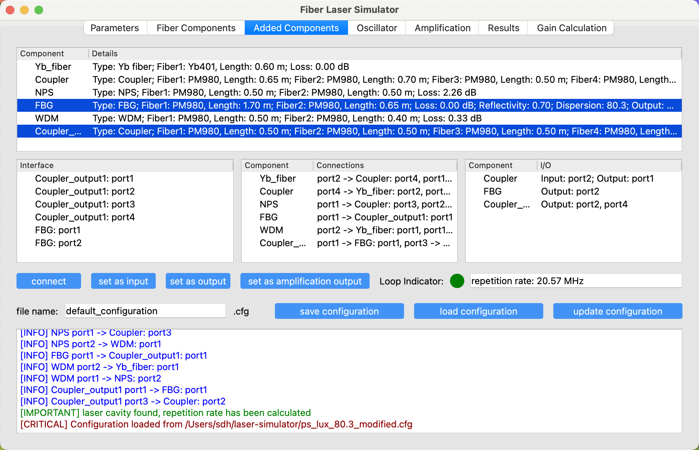
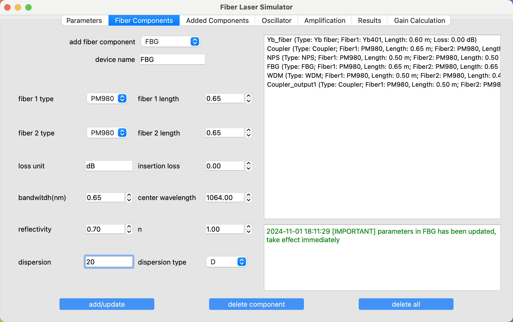
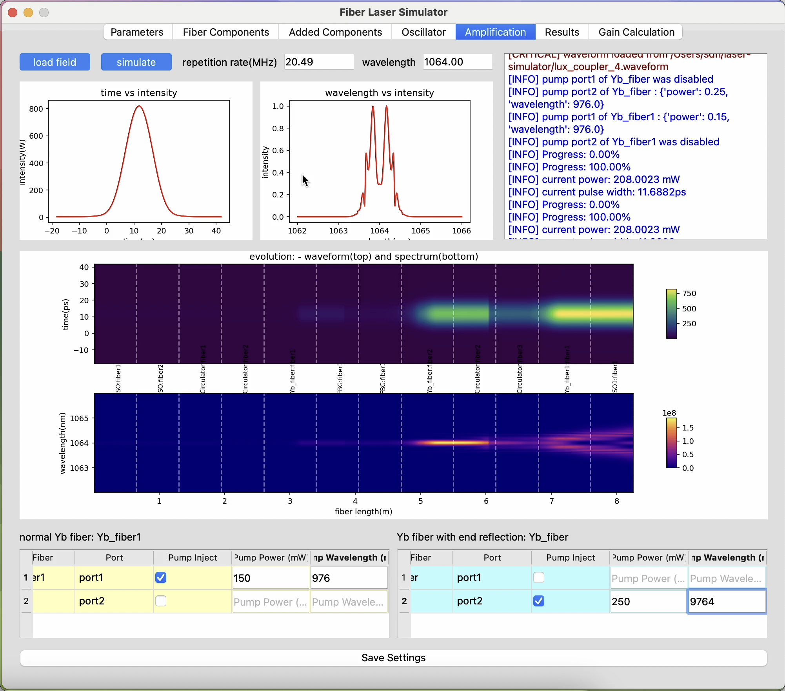
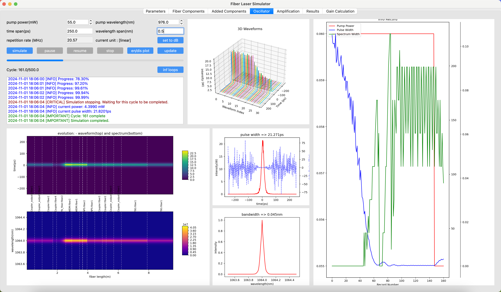

# Ultrafast Fiber Laser Simulation Desktop Application

**Ultrafast Fiber Laser Simulation** application—a practical tool for designing and simulating ultrafast fiber laser systems. This desktop application provides an interactive and intuitive environment for laser simulation, enabling users to explore, optimize, and understand ultrafast fiber laser dynamics.

## Key Features

### Accurate Fiber Laser Simulation
Simulate ultrafast fiber laser systems with precision, modeling complex interactions and phenomena to closely reflect real-world behavior.

### User-Friendly, Lab-Like Interface
An interface designed to resemble a lab environment, allowing you to build laser systems step-by-step, just as you would in a real experimental setup.

### Comprehensive Fiber Component Library
Access a rich catalog of fiber components with realistic properties, enabling precise simulations across diverse configurations.

### Smart Detection of Laser Cavity & Amplification
The app automatically identifies whether your setup forms a functional laser cavity or is configured for amplification, streamlining the simulation process.

### Interactive Pulse Amplification & Compression
Explore pulse amplification and compression, observing their effects on laser output with dynamic visual feedback.

### Real-Time Parameter Adjustment
Easily modify parameters in the middle of a simulation such as fiber lengths, FBG reflectivity, and dispersion, and see the impact of each adjustment instantly.

### Save, Load, and Share Configurations
Save and load cavity configurations for easy access to previous setups or to share results.

### Real-Time Simulation Status
Stay updated on simulation progress with real-time status checks, giving insights at every phase.

---

## Demo Highlights

### Simulation Walkthrough
See a complete laser system simulation in action, demonstrating the application’s capabilities.

### Live Parameter Adjustments
Observe real-time parameter changes and their effects on laser performance, giving you control over each simulation detail.

### Pulse Amplification & Compression
Discover the details of pulse amplification and compression in interactive demonstrations.

### Simulation Status Monitoring
Check simulation status anytime for detailed insights into current project.

---

## Contributing

Have suggestions? Open an issue or start a discussion. 

---

## Contact

For questions, feedback, or collaboration opportunities, feel free to reach out: [houshaodong1992@gmail.com](mailto:houshaodong1992@gmail.com).
